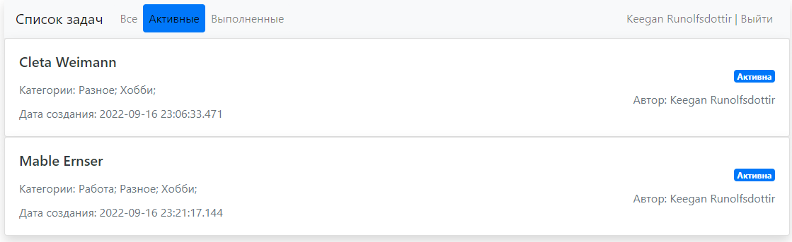

# Приложение TODO List
* [Описание](#описание)
* [Функционал](#функционал)
* [Технологии](#технологии)
* [Сборка](#сборка)
* [Интерфейс](#интерфейс)

## Описание
Web-приложения для постановки и отслеживания задач. Позволяет составлять списки задач и закрывать их по мере выполнения. В системе предусмотрена регистрация и авторизация пользователей.

## Функционал
* Регистрация и авторизация пользователя
* Добавление заданий в TODO-list
* Возможность пометить задачу как активную/выполненную
* Выбор категории задания
* Вывод на страницы всех/активных/выполненных заданий

## Технологии
* Java 16
* Spring (Boot, Data)
* HTML
* Bootstrap
* PostgreSQL
* Hibernate
* Liquibase
* Maven

## Сборка
1. Скачайте исходники `git clone https://github.com/svedentsov/job4j_todo.git`
2. Создайте базу данных в соответствии с настройками, указанными в файле hibernate.cfg.xml.
3. После запуска сервера приложение будет доступно по адресу `http://localhost:8080/loginPage`

## Интерфейс
Для начала работы в приложении необходимо ввести свои логин и пароль или зарегистрироваться.

Главное окно приложения состоит из списка задач, каждая задача помечена меткой "Активна" или "Выполнена".

Для добавления задачи, нажмите кнопку "Добавить задачу".

Кликнув по названию можно перейти в карточку задачи, где указано описание. Есть возможность редактировать задачу, отметить как "Выполнена", а также удалить задачу.

Так же можно перейти на страницу отображения только выполненных или только активных задач.

